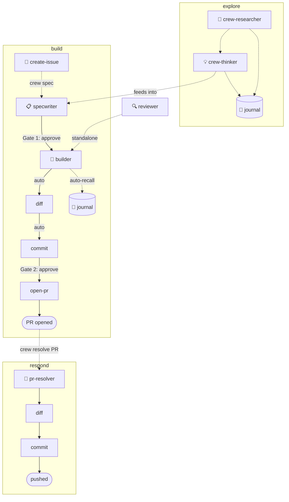

# 🏴‍☠️ El Capitan

Your engineering crew, orchestrated. Spec it, build it, ship it — you just approve.

el-capitan is a portable system of AI agents and skills for [Cursor](https://cursor.com) and [Claude Code](https://docs.anthropic.com/en/docs/claude-code) that handles speccing, implementing, reviewing, committing, and PR management. Three layers — a **router** dispatches commands, an **orchestrator** manages pipeline state, and a **runtime** (ralph, hooks, journal) does the work. You make two decisions: **approve the spec** and **approve the commit message**. Everything else auto-advances.


## Workflows

Three workflows. Build something, respond to review, or explore first. Pick one — the system chains the right agents.

### build

Build anything: a feature, a bug fix, a refactor, a chore.

- **Entry**: `crew start build` or `crew spec <issue>`
- **Stages**: spec → implement → diff → commit → open-pr
- **Terminal**: PR opened as draft
- Note: crew-specwriter infers the spec template (standard or bug) from the request content — no `--type` flag needed.

### respond

Respond to review comments on an open PR.

- **Entry**: `crew start review-cycle <PR>` or `crew resolve PR <PR>`
- **Stages**: address-pr → diff → commit → push
- **Terminal**: all review threads resolved and pushed; reviewer approval is external

### explore

Brainstorm or research before building.

- **Entry**: `crew brainstorm` or `crew learn`
- Open-ended — no stages, no gates, no terminal condition.
- Optionally feeds into `build` when you're ready to spec something.
- Note: explore has no persistent state — `crew status` will not detect an active explore session. When you're ready to commit to a direction, run `crew spec` to transition into the build workflow.

## Quick start

```bash
git clone git@github.com:crespocarlos/el-capitan.git ~/el-capitan
bash ~/el-capitan/install.sh
```

Then, in any repo:

> Type these in Cursor's chat or Claude Code — not your terminal.

Start a new build:
```
crew start build
```

Or go directly to speccing from an issue:
```
crew spec https://github.com/org/repo/issues/123
```

## Full command reference

All commands start with `crew`. Explicit routing only — no guessing.

### Pipeline

| Command | What it does |
|---|---|
| `crew create issue: Lens throws when esqlVariables is null` | Structure and file a GitHub issue |
| `crew spec https://github.com/org/repo/issues/123` | Draft a SPEC.md from an issue |
| `crew implement` | Create worktree + build from SPEC |
| `crew diff` | Review the local diff |
| `crew commit` | Propose a semantic commit message |
| `crew open pr` | Push + open a draft PR |
| `crew resolve PR #456` | Handle open review comments |
| `crew start build` | Start a new build workflow (alias for `crew spec`) |
| `crew start review-cycle <PR>` | Start a respond workflow (alias for `crew resolve PR`) |

### Standalone

| Command | What it does |
|---|---|
| `crew review` | Multi-lens self-review of your branch |
| `crew review PR #456` | Multi-lens review of someone else's PR |
| `crew review spec` | Multi-lens review of the active SPEC.md |
| `crew learn git worktrees` | Fetch + teach a concept (routes to researcher, then thinker) |
| `crew learn https://article.com/post` | Fetch + teach from a URL (URL/PR → researcher; concept → thinker) |
| `crew brainstorm` | Creative session — connect ideas, challenge assumptions |
| `crew brainstorm: what if we cached the API responses?` | Interactive brainstorm on a topic |
| `crew log` | Log the engineering session to the journal |
| `crew recall: how do we handle retries in kibana?` | Search journal by meaning |
| `crew cleanup` | Remove stale worktrees interactively |
| `crew implement --parallel` | Parallel implementation attempts (best-of-n, handled inside crew-builder) |
| `crew autopilot` | Auto-advance pipeline to next gate |
| `crew status` | Print current pipeline state |
| `crew migrate` | Migrate task state from old repo/branch layout to UUID layout |

## How it works



**Three workflows. Two gates in `build`.** Run `crew autopilot` to chain from your current state to the next gate, or type each command manually — your choice.

## The crew

Crew agents dispatch persona subagents in parallel for multi-lens analysis. Skills run inline for quick, interactive tasks.

### 📋 crew-specwriter

Reads an issue or plain description, explores the codebase for patterns and conventions, and drafts a `SPEC.md` with acceptance criteria tight enough for autonomous implementation. Runs a silent self-critique phase (scope, adversarial, implementer personas) before presenting the spec — catches engineering problems before they reach Gate 1.

- **crew-create-issue** — structures a rough idea into a well-formed GitHub issue (summary, repro steps, AC), asks gap-filling questions, files it with `gh`, and suggests `crew spec` as the next step

### 🔨 crew-builder

The implementation engine. Codes in isolation from a SPEC — runs per-task acceptance checks and hands back a report. Launched by `crew implement`, which handles the setup:

- **crew-implement** — selects the spec, creates a worktree, auto-recalls repo patterns, then launches the builder
- **crew-diff** — reviews the local diff for type safety, missing tests, and pattern violations
- **crew-commit** — proposes a [conventional commit](https://www.conventionalcommits.org/) message, waits for approval
- **crew-open-pr** — pushes the branch, generates a PR description, opens a draft PR (fork-aware)
- **crew-cleanup** — interactive removal of stale worktrees, local branches, and task directories

### 🔍 crew-reviewer

Unified multi-lens review. Launches specialized reviewer personas in parallel (Code Quality, Adversarial, Fresh Eyes, plus signal-triggered Architecture and Product Flow), consolidates findings into a single prioritized report. Three modes: self-review your branch, review someone else's PR, or review a SPEC.md before approving it.

### 🧩 crew-pr-resolver

When someone reviews *your* PR — fetches all unresolved threads and processes them in batch: applying, adapting, rejecting, or deferring each one.


### 🔬 crew-researcher

Give it a URL, a PR, a repo, or just a concept name — it fetches the content, distills what matters, and teaches you. Writes a rich learning entry to the journal so the knowledge persists.

### 💡 crew-thinker

The brainstorm partner. Two modes: *pipeline* (dispatches 4 thinking personas in parallel — builder, contrarian, connector, pragmatist — and consolidates into a report with explicit tensions) or *brainstorm* (interactive back-and-forth to flesh out ideas, challenge assumptions, and explore what-if scenarios). Can offer to draft a SPEC when an idea solidifies.

- **crew-log** — records an engineering session, auto-gathers context, writes to the monthly journal
- **crew-recall** — searches the journal by meaning (semantic search), metadata (grep), or overview (summary)

### 🔄 crew-migrate

One-time utility. Migrates task state from the old `~/.agent/tasks/<repo>/<branch>/<slug>/` layout to the current UUID layout (`~/.agent/tasks/<uuid>/`). Run if `crew status` shows no active task but you have pre-UUID task directories. Safe to skip if you set up el-capitan after the UUID migration.

## Architecture

Three layers, each with a clear job:

| Layer | File | Responsibility |
|---|---|---|
| **Router** | `.cursor/rules/crew-router.mdc` | Pure dispatch — trigger in, handler out |
| **Pipeline orchestrator** | `.cursor/rules/crew-orchestrator.mdc` | Pipeline state machine, session awareness, autopilot |
| **Crew agents** | `~/.claude/agents/crew-*.md` | Orchestrate multi-persona workflows (spec, review, build, etc.) |
| **Runtime** | ralph, hooks, journal, automations | Execution engines — do the actual work |

The router maps `crew <command>` to the right handler. The pipeline orchestrator knows where you are in the pipeline (via git/gh state) and can auto-advance between gates. Crew agents each own a workflow and dispatch persona subagents in parallel. The runtime does the heavy lifting.

### Autopilot

`crew autopilot` chains from your current pipeline state to the next gate:

- After spec approval: implement → diff → commit (stops for approval)
- After commit approval: open PR → done

If anything fails, autopilot pauses and surfaces the error. No auto-retry — you decide.

`crew autopilot` is not a mode toggle. It means "advance from here." Use it mid-pipeline or from the start.

## Subagent dispatch

Heavy agents run as isolated subagents, keeping the orchestrator's context clean. Multi-persona orchestrators (review, spec, brainstorm) dispatch persona subagents in parallel — each persona gets its own context window.

| Command | Runs as |
|---|---|
| `crew spec`, `crew review`, `crew learn`, `crew brainstorm` | Isolated subagent |
| `crew implement` | Subagent (via crew-builder) |
| `crew implement --parallel` | 2-3 best-of-n runners in parallel worktrees |
| Everything else | Inline in orchestrator |

Persona subagents (e.g., `reviewer-adversarial`, `specwriter-scope`, `thinker-builder`) are registered as native subagents in both environments — Cursor dispatches via Task tool, Claude Code via Agent tool. Falls back to `claude -p` file-based dispatch when neither is available.

## Ralph (optional, recommended)

[ralph](https://github.com/simianhacker/ralph-loop) is a code agent that runs autonomously — an external loop runner that manages implementation across multiple turns without holding a conversation open.

**Status:** Optional but recommended for `crew implement`. The implementation experience is noticeably smoother with ralph.

**Mode difference:**
- **Ralph mode** (`which ralph` found): ralph manages the build loop autonomously — implements each task, runs acceptance checks, retries on failure, and hands back a report.
- **Inline mode** (ralph not found): Claude handles the build steps directly in the current session — same tasks and checks, just conversational rather than autonomous.

**When ralph is missing:** `crew implement` falls back to inline implementation automatically.

## Claude Code hooks

When using Claude Code, project-level hooks in `.claude/settings.json` provide observability:

- **PostToolUse** — logs every Bash/Write/Edit call to `~/.agent/telemetry/` as JSONL
- **Notification** — macOS notification when Claude needs your input
- **SessionStart** — logs session start time

Hooks never block the agent — all exit 0 on error. Telemetry data is local-only.

## Cursor Automations

Run crew members as event-driven cloud agents without the IDE. Two modes:

- **Gated** — automations comment/suggest, you decide (PR review as comment, diff analysis, weekly cleanup as PR)
- **Automated** — automations handle the full pipeline (review + approve, auto-fix on push, spec from labeled issues)

Configure at [cursor.com/automations](https://cursor.com/automations).

## Key features

### Worktree-first

`crew implement` creates a git worktree with a conventional branch (`feature/`, `bugfix/`, etc.) in a sibling `worktrees/` directory so implementation happens in isolation. `crew-pr-resolver` resolves to the correct worktree before applying changes. Main stays clean. Worktrees whose branches have been merged are auto-pruned on next invocation.

### Journal-based memory

Patterns, conventions, and learnings live in `~/.agent/journal/` as monthly markdown files with local embeddings. Key crew members auto-recall repo-specific patterns at session start — no manual config needed.

### Local semantic search

Optional but powerful. Uses [Ollama](https://ollama.ai) + ChromaDB — everything stays on your machine.

```bash
ollama pull nomic-embed-text
pip install chromadb ollama
journal-search.py index
```

Without these, everything works — `crew-recall` falls back to ripgrep.

### Add-ons

Drop custom agents or skills into `~/.cursor/agents/` or `~/.cursor/skills/` as regular files (not symlinks). The orchestrator discovers them at runtime.

```bash
# Symlinks = core (el-capitan), regular files = your add-ons
find ~/.cursor/agents ~/.cursor/skills -maxdepth 2 -type f -name '*.md' ! -type l
```

To add a custom skill: create `~/.cursor/skills/<name>/SKILL.md` with a `## Protocol` section. To add a custom agent: create `~/.cursor/agents/<name>.md` with YAML frontmatter (`name`, `description`) and a prompt. Add an entry to `crew-router.mdc` to route a trigger to it.

## Task state

All task data lives outside any repo at `~/.agent/`. Each task gets a UUID directory resolved automatically from git state.

```
~/.agent/
├── PROFILE.md                        ← your context (optional, gitignored)
├── journal/                          ← monthly entries with embeddings
├── vectorstore/                      ← ChromaDB data (auto-created)
├── tools/journal-search.py           ← semantic search CLI
└── tasks/<uuid>/                     ← SPEC.md, PROGRESS.md, SESSION.md, REPORT.md
```

Multiple tasks can coexist — each has its own UUID directory with a `.task-id` JSON file binding it to a repo remote URL and branch. Completed tasks stay alongside active ones. Journal and profile are private — never tracked by git.

> If you have task state from before the UUID migration, run `crew migrate` to move it to the new layout.

## PROFILE.md

`~/.agent/PROFILE.md` is your personal context file — it persists across sessions and machines, and is never tracked by any git repo.

**Which commands read it:** `crew brainstorm`, `crew thinker` (pipeline mode), `crew spec` (optional context), `crew implement` (auto-recall of repo patterns at build start).

**What's useful to include:** your role, current project, build context, preferences, and any recurring patterns you want the crew to apply.

**Minimal starter example:**

```markdown
# Profile

**Role:** Senior engineer, backend focus
**Current project:** Distributed event pipeline for real-time analytics
**Stack:** TypeScript, Node.js, Kafka, PostgreSQL
**Preferences:** Prefer explicit error types over any-catch, no magic globals
**Recurring context:** We use feature flags (LaunchDarkly) — any new behavior should be gated
```

## Prerequisites

| Requirement | Required? |
|---|---|
| [Cursor](https://cursor.com) or [Claude Code](https://docs.anthropic.com/en/docs/claude-code) | Yes |
| Git + [GitHub CLI (`gh`)](https://cli.github.com) | Yes |
| Python 3.9+ | For semantic search |
| [Ollama](https://ollama.ai) + `nomic-embed-text` | Optional — local journal semantic search |
| `pip install chromadb ollama` | Optional — journal semantic search dependencies |
| `ralph` | Optional — autonomous implementation runner |
| `claude mcp add --scope user SemanticCodeSearch -- npx @elastic/semantic-code-search-mcp-server` | Optional — enables semantic code search in Claude Code; used by `crew review` (reviewer-explorer persona) and `crew spec` (specwriter-explorer persona) to find relevant patterns beyond keyword matching |

**macOS note:** The notification hook (`osascript`, iTerm2 focus) requires macOS. It skips gracefully on non-macOS systems — no configuration needed.

## Install

```bash
git clone git@github.com:crespocarlos/el-capitan.git ~/el-capitan
bash ~/el-capitan/install.sh
```

New machine = clone + install. Everything restored via symlinks. Task state starts empty. Journal and profile persist locally.

## Data & Privacy

**What leaves your machine:** Claude API calls with the prompt content you send — code snippets, file content in context windows, and commands you type. This is sent to Anthropic's API under your API key.

**What stays local:**
- Journal entries (`~/.agent/journal/`) — private, never synced
- Task state (`~/.agent/tasks/`) — private, never synced
- `.claude/` config — your hooks, settings, and agent files (in-repo, but gitignored if you choose)
- Worktrees (`../worktrees/`) — local git worktrees, not pushed until `crew open pr`
- PROFILE.md — private, never synced

No telemetry is sent to el-capitan's maintainers. The only outbound traffic is your Claude API usage.

## License

[MIT](LICENSE)
