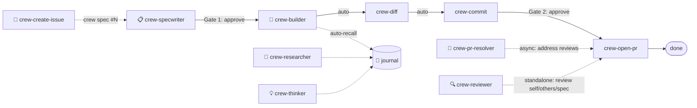

# 🏴‍☠️ El Capitan

Your engineering crew, orchestrated. Spec it, build it, ship it — you just approve.

el-capitan is a portable system of AI agents and skills for [Cursor](https://cursor.com) and [Claude Code](https://docs.anthropic.com/en/docs/claude-code) that handles speccing, implementing, reviewing, committing, and PR management. Three layers — a **router** dispatches commands, an **orchestrator** manages pipeline state, and a **runtime** (ralph, hooks, journal) does the work. You make two decisions: **approve the spec** and **approve the commit message**. Everything else auto-advances.

## Quick start

```bash
git clone git@github.com:crespocarlos/el-capitan.git ~/el-capitan
bash ~/el-capitan/install.sh
```

Then, in any repo:

```
crew spec https://github.com/org/repo/issues/123
```

## Usage

All commands start with `crew`. Explicit routing only — no guessing.

### Pipeline

| Command | What it does |
|---|---|
| `crew create issue: Lens throws when esqlVariables is null` | Structure and file a GitHub issue |
| `crew spec https://github.com/org/repo/issues/123` | Draft a SPEC.md from an issue |
| `crew implement` | Create worktree + build from SPEC |
| `crew diff` | Review the local diff |
| `crew commit` | Propose a semantic commit message |
| `crew open pr` | Push + open a draft PR |
| `crew address PR #456` | Handle open review comments |

### Standalone

| Command | What it does |
|---|---|
| `crew review` | Multi-lens self-review of your branch |
| `crew review PR #456` | Multi-lens review of someone else's PR |
| `crew review spec` | Multi-lens review of the active SPEC.md |
| `crew eval: reviewer says use retry() instead` | Evaluate a single code suggestion |
| `crew learn git worktrees` | Fetch + teach a concept |
| `crew learn https://article.com/post` | Fetch + teach from a URL |
| `crew brainstorm` | Creative session — connect ideas, challenge assumptions |
| `crew brainstorm: what if we cached the API responses?` | Interactive brainstorm on a topic |
| `crew log` | Log the engineering session to the journal |
| `crew recall: how do we handle retries in kibana?` | Search journal by meaning |
| `crew cleanup` | Remove stale worktrees interactively |
| `crew implement --parallel` | Parallel implementation attempts (best-of-n) |
| `crew automations` | Reference guide for Cursor Automations setup |
| `crew autopilot` | Auto-advance pipeline to next gate |
| `crew status` | Print current pipeline state |

## How it works



**Two gates. Everything between auto-advances.** Run `crew autopilot` to chain the full segment, or type each command manually — your choice.

## The crew

Six orchestrator agents, twelve persona subagents, and ten skills. Orchestrators dispatch persona subagents in parallel for multi-lens analysis. Skills run inline for quick, interactive tasks.

### 📋 crew-specwriter

Reads an issue or plain description, explores the codebase for patterns and conventions, and drafts a `SPEC.md` with acceptance criteria tight enough for autonomous implementation. Runs a silent self-critique phase (scope, adversarial, implementer personas) before presenting the spec — catches engineering problems before they reach Gate 1.

- **crew-create-issue** — structures a rough idea into a well-formed GitHub issue (summary, repro steps, AC), asks gap-filling questions, files it with `gh`, and suggests `crew spec` as the next step

### 🔨 crew-builder

The implementation engine. Codes in isolation from a SPEC — runs per-task acceptance checks and hands back a report. Launched by `crew implement`, which handles the setup:

- **crew-implement** — selects the spec, creates a worktree, auto-recalls repo patterns, then launches the builder
- **crew-diff** — reviews the local diff for type safety, missing tests, and pattern violations
- **crew-commit** — proposes a [conventional commit](https://www.conventionalcommits.org/) message, waits for approval
- **crew-open-pr** — pushes the branch, generates a PR description, opens a draft PR (fork-aware)
- **crew-cleanup** — interactive removal of stale worktrees, local branches, and task directories

### 🔍 crew-reviewer

Unified multi-lens review. Launches specialized reviewer personas in parallel (Code Quality, Adversarial, Fresh Eyes, plus signal-triggered Architecture and Product Flow), consolidates findings into a single prioritized report. Three modes: self-review your branch, review someone else's PR, or review a SPEC.md before approving it.

### 🧩 crew-pr-resolver

When someone reviews *your* PR — fetches all unresolved threads and processes them in batch: applying, adapting, rejecting, or deferring each one.

- **crew-eval-pr-comments** — evaluates a single suggestion from any source (reviewer, Copilot, colleague). Presents its verdict for your approval before acting.

### 🔬 crew-researcher

Give it a URL, a PR, a repo, or just a concept name — it fetches the content, distills what matters, and teaches you. Writes a rich learning entry to the journal so the knowledge persists.

### 💡 crew-thinker

The brainstorm partner. Two modes: *pipeline* (dispatches 4 thinking personas in parallel — builder, contrarian, connector, pragmatist — and consolidates into a report with explicit tensions) or *brainstorm* (interactive back-and-forth to flesh out ideas, challenge assumptions, and explore what-if scenarios). Can offer to draft a SPEC when an idea solidifies.

- **crew-log** — records an engineering session, auto-gathers context, writes to the monthly journal
- **crew-recall** — searches the journal by meaning (semantic search), metadata (grep), or overview (summary)

## Architecture

Three layers, each with a clear job:

| Layer | File | Responsibility |
|---|---|---|
| **Router** | `.cursor/rules/crew-router.mdc` | Pure dispatch — trigger in, handler out |
| **Orchestrator** | `.cursor/rules/crew-orchestrator.mdc` | Pipeline state machine, session awareness, autopilot |
| **Runtime** | ralph, hooks, journal, automations | Execution engines — do the actual work |

The router maps `crew <command>` to the right handler. The orchestrator knows where you are in the pipeline (via PROGRESS.md) and can auto-advance between gates. The runtime does the heavy lifting.

### Autopilot

`crew autopilot` chains from your current pipeline state to the next gate:

- After spec approval: implement → diff → commit (stops for approval)
- After commit approval: open PR → done

If anything fails, autopilot pauses and surfaces the error. No auto-retry — you decide.

`crew autopilot` is not a mode toggle. It means "advance from here." Use it mid-pipeline or from the start.

## Subagent dispatch

Heavy agents run as isolated subagents, keeping the orchestrator's context clean. Multi-persona orchestrators (review, spec, brainstorm) dispatch persona subagents in parallel — each persona gets its own context window.

| Command | Runs as |
|---|---|
| `crew spec`, `crew review`, `crew learn`, `crew brainstorm` | Isolated subagent |
| `crew implement` | Subagent (via crew-builder) |
| `crew implement --parallel` | 2-3 best-of-n runners in parallel worktrees |
| Everything else | Inline in orchestrator |

Persona subagents (e.g., `reviewer-adversarial`, `specwriter-scope`, `thinker-builder`) are registered as native subagents in both environments — Cursor dispatches via Task tool, Claude Code via Agent tool. Falls back to `claude -p` file-based dispatch when neither is available.

## Claude Code hooks

When using Claude Code, project-level hooks in `.claude/settings.json` provide observability:

- **PostToolUse** — logs every Bash/Write/Edit call to `~/.agent/telemetry/` as JSONL
- **Notification** — macOS notification when Claude needs your input
- **SessionStart** — logs session start time

Hooks never block the agent — all exit 0 on error. Telemetry data is local-only.

## Cursor Automations

Run crew members as event-driven cloud agents without the IDE. Two modes:

- **Gated** — automations comment/suggest, you decide (PR review as comment, diff analysis, weekly cleanup as PR)
- **Automated** — automations handle the full pipeline (review + approve, auto-fix on push, spec from labeled issues)

Run `crew automations` for the full configuration reference. Configure at [cursor.com/automations](https://cursor.com/automations).

## Key features

### Worktree-first

`crew implement` creates a git worktree with a conventional branch (`feature/`, `bugfix/`, etc.) in a sibling `worktrees/` directory so implementation happens in isolation. `crew-pr-resolver` resolves to the correct worktree before applying changes. Main stays clean. Worktrees whose branches have been merged are auto-pruned on next invocation.

### Journal-based memory

Patterns, conventions, and learnings live in `~/.agent/journal/` as monthly markdown files with local embeddings. Key crew members auto-recall repo-specific patterns at session start — no manual config needed.

### Local semantic search

Optional but powerful. Uses [Ollama](https://ollama.ai) + ChromaDB — everything stays on your machine.

```bash
ollama pull nomic-embed-text
pip install chromadb ollama
journal-search.py index
```

Without these, everything works — `crew-recall` falls back to ripgrep.

### Add-ons

Drop custom agents or skills into `~/.cursor/agents/` or `~/.cursor/skills/` as regular files. The orchestrator discovers them at runtime.

```bash
# Symlinks = core (el-capitan), regular files = your add-ons
find ~/.cursor/agents ~/.cursor/skills -maxdepth 2 -type f -name '*.md' ! -type l
```

## Task state

All task data lives outside any repo at `~/.agent/`:

```
~/.agent/
├── PROFILE.md                        ← your context (optional, gitignored)
├── journal/                          ← monthly entries with embeddings
├── vectorstore/                      ← ChromaDB data (auto-created)
├── tools/journal-search.py           ← semantic search CLI
└── tasks/<repo>/<branch>/<slug>/     ← SPEC.md, PROGRESS.md, SESSION.md, REPORT.md
```

Each task gets its own slug directory (e.g. `tasks/kibana/main/add-retry-logic/`). Multiple specs can coexist per branch — completed tasks stay alongside active ones. Path resolved automatically from git state. Journal and profile are private — never tracked by git.

## Prerequisites

| Requirement | Required? |
|---|---|
| [Cursor](https://cursor.com) or [Claude Code](https://docs.anthropic.com/en/docs/claude-code) | Yes |
| Git + [GitHub CLI (`gh`)](https://cli.github.com) | Yes |
| Python 3.9+ | For semantic search |
| [Ollama](https://ollama.ai) + `nomic-embed-text` | Optional — local semantic search |
| `pip install chromadb ollama` | Optional — semantic search dependencies |

## Install

```bash
git clone git@github.com:crespocarlos/el-capitan.git ~/el-capitan
bash ~/el-capitan/install.sh
```

New machine = clone + install. Everything restored via symlinks. Task state starts empty. Journal and profile persist locally.

## License

[MIT](LICENSE)
