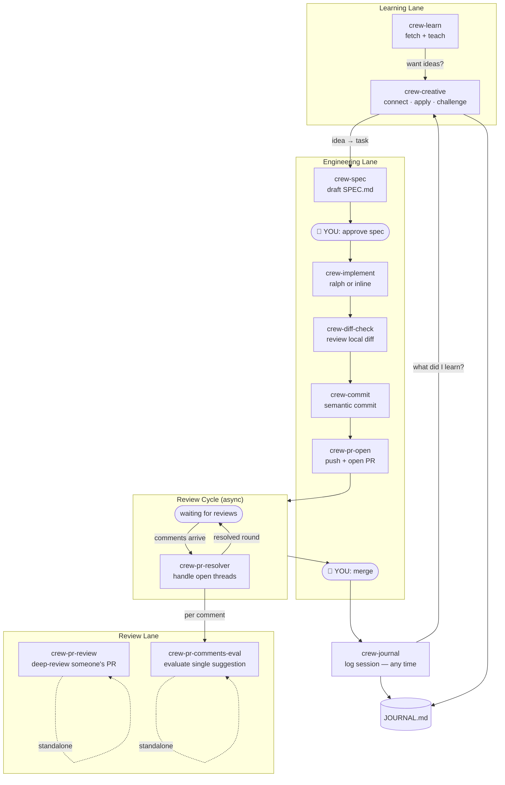

# el-capitan

A portable personal agentic engineering orchestrator for Cursor and Claude Code.

el-capitan is a crew of AI agents and skills that handle the repetitive parts of engineering work — speccing, reviewing, committing, handling PR feedback, learning — so you can focus on the two decisions that matter: **approving the spec** and **merging the PR**.

## How it works



**You appear at two gates only.** Everything between runs autonomously.

## Crew

| Name | Type | What it does |
|------|------|-------------|
| **crew-spec** | agent | Fetches a GitHub issue, explores the codebase, drafts a SPEC.md with acceptance criteria |
| **crew-implement** | skill | Drives implementation through SPEC.md tasks — uses a ralph tool if available, otherwise works inline |
| **crew-diff-check** | skill | Scans `git diff` for type safety issues, missing tests, pattern violations |
| **crew-commit** | skill | Reads diff + SPEC.md, proposes a conventional commit message, waits for approval |
| **crew-pr-open** | skill | Pushes branch, generates PR description from SPEC.md + commits, opens a draft PR |
| **crew-pr-review** | skill | Deep-reviews someone else's PR — reads full files, traces impact, verifies tests |
| **crew-pr-resolver** | agent | Fetches all unresolved PR threads on your PR, processes each one (apply/adapt/reject/defer) |
| **crew-pr-comments-eval** | skill | Evaluates a single code suggestion from any source (reviewer, Copilot, colleague) |
| **crew-journal** | skill | Logs an engineering session — 3 questions, appends to JOURNAL.md, surfaces CLAUDE.md candidates |
| **crew-learn** | agent | Fetches a URL, PR, repo, or concept and teaches you what matters |
| **crew-creative** | agent | Connects learning to past sessions, generates ideas, pushes back on assumptions |

### PR crew — four members, four jobs

- **crew-pr-open** — push and open a draft PR with a generated description. Asks about LLM assistance; if yes, appends 🤖 to the description.
- **crew-pr-review** — you review someone else's code (outbound review)
- **crew-pr-resolver** — someone reviewed your code, handle their feedback (inbound batch). Replies are prefixed with 🤖 to distinguish agent comments from human ones.
- **crew-pr-comments-eval** — evaluate a single suggestion from any source (inline). Defines the evaluation framework and GitHub comment format used by crew-pr-resolver.

## Pipeline

```
crew-spec → [approve] → crew-implement → crew-diff-check → crew-commit → crew-pr-open → [review cycle] → [merge]
```

The review cycle is async: after crew-pr-open, reviewers comment (minutes to days later), you run crew-pr-resolver, more comments arrive, you run it again. It repeats until the PR is ready to merge.

When a gate fails:
- **Spec rejected** — revise and re-present
- **Diff check finds issues** — fix, then re-run
- **PR comments need input** — surface to user, wait, resume

## Task state

Task files live outside any repo at `~/.agent/tasks/<repo>/<branch>/`:

```
~/.agent/
├── _SPEC_TEMPLATE.md          ← reusable template
├── JOURNAL.md                  ← append-only session log
└── tasks/
    └── kibana/                 ← auto-derived from git
        ├── feat-retry-logic/
        │   ├── SPEC.md
        │   └── PROGRESS.md
        └── fix-flaky-test/
            └── SPEC.md
```

Path resolved automatically:
```bash
~/.agent/tasks/$(basename $(git rev-parse --show-toplevel))/$(git branch --show-current)/
```

## Add-ons

Core crew ships with el-capitan (installed as symlinks). Add-ons are skills or agents you drop directly into `~/.cursor/agents/` or `~/.cursor/skills/` as regular files — no changes to el-capitan needed.

```bash
# See what's installed — symlinks = core, regular files = add-ons
find ~/.cursor/agents ~/.cursor/skills -maxdepth 2 -type f -name '*.md' ! -type l
```

The orchestrator discovers add-ons at runtime and routes to them by matching triggers to their description frontmatter.

## Install

```bash
git clone git@github.com:carloscrespo/el-capitan.git ~/el-capitan
bash ~/el-capitan/install.sh
```

New machine = clone + install. All agents, skills, rules, templates, and journal restored via symlinks. `~/.agent/tasks/` starts empty — task state is ephemeral per machine.

## File layout

```
~/el-capitan/                            ← git repo (portable)
├── install.sh
├── README.md
├── .claude/
│   └── CLAUDE.md                        ← agent context for Claude Code
├── .cursor/
│   ├── rules/
│   │   ├── crew-orchestrator.mdc          ← crew manifest (always on)
│   │   └── crew-learn.mdc                 ← learning router
│   ├── agents/
│   │   ├── crew-spec.md
│   │   ├── crew-learn.md
│   │   ├── crew-creative.md
│   │   └── crew-pr-resolver.md
│   └── skills/
│       ├── crew-commit/SKILL.md
│       ├── crew-diff-check/SKILL.md
│       ├── crew-implement/SKILL.md
│       ├── crew-journal/SKILL.md
│       ├── crew-pr-comments-eval/SKILL.md
│       ├── crew-pr-open/
│       │   ├── SKILL.md
│       │   └── references/
│       │       └── pr-template.md      ← default PR description format
│       └── crew-pr-review/
│           ├── SKILL.md
│           └── references/
│               ├── commands.md          ← gh commands, consumer-finding patterns
│               └── review-patterns.md   ← review dimensions, size-based strategy
└── .agent/
    ├── _SPEC_TEMPLATE.md
    └── JOURNAL.md
```

## Design decisions

**Skills vs agents.** Skills are stateless instructions the main agent follows inline — good for single-purpose tasks (commit, diff check, journal). Agents are autonomous subagents launched as separate processes — good for multi-step tasks that fetch data and make decisions (spec, learn, PR resolution).

**Skills with references.** Complex skills like crew-pr-review and crew-pr-open use a `references/` directory for command patterns, templates, and review frameworks. This keeps the main SKILL.md workflow-focused while providing concrete detail the agent reads when needed.

**Agent comments are labeled.** When crew-pr-resolver posts replies on GitHub, they're prefixed with 🤖 so reviewers can tell agent responses from human ones. When crew-pr-open creates a PR with LLM assistance, 🤖 is appended to the description.

**Symlinks, not copies.** `install.sh` creates per-file symlinks from `~/.cursor/` into the repo. This means core crew members are always in sync with the repo, while add-ons (regular files) live alongside without being tracked.

**Ralph-agnostic implementation.** crew-implement follows the "ralph" pattern — loop over spec tasks until done — but doesn't depend on any specific tool. If `ralph`, `ralph.sh`, or a similar CLI is in PATH, it hands off. Otherwise it runs the same protocol inline in Cursor. This means the skill works anywhere without extra dependencies, but benefits from purpose-built loop tools when available.

**No second-opinion agent.** Consulting a different model (Gemini, etc.) for a second take is occasionally useful, but not frequently enough to justify a crew member. When needed, run the CLI directly. If model diversity proves consistently valuable, the right move is adding it as a step inside crew-spec or crew-pr-review, not as a standalone agent.

**JOURNAL.md is portable, tasks/ is not.** The journal captures cross-session learning and is symlinked from the repo. Task state (SPEC.md, PROGRESS.md) is ephemeral and machine-local — different machines may have different branches checked out.

**Review dimensions from CodeRabbit.** crew-pr-review's [review patterns](https://github.com/carloscrespo/el-capitan/blob/main/.cursor/skills/crew-pr-review/references/review-patterns.md) use CodeRabbit's six review categories (functional correctness, stability, performance, data integrity, security, maintainability) as the scanning framework, but focus depth on what automated tools miss: intent mismatches, cross-component impact, and completeness gaps.
