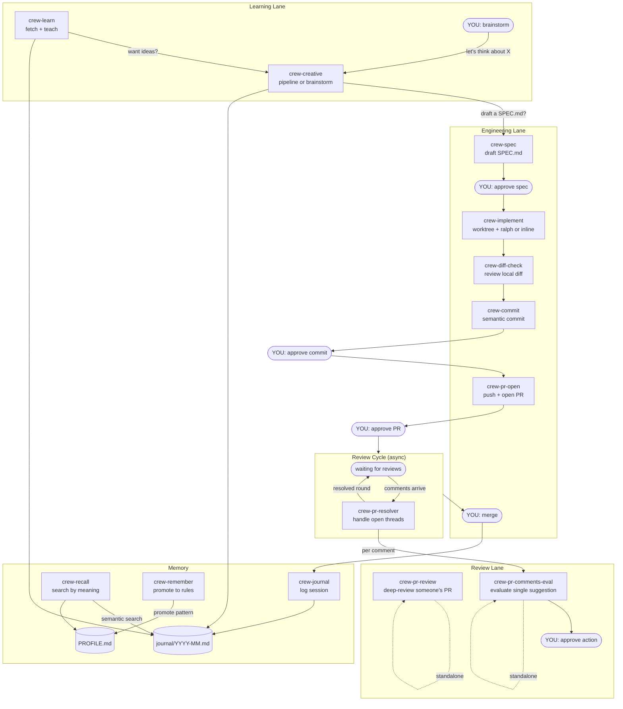

# el-capitan

A portable personal agentic engineering orchestrator for Cursor and Claude Code.

el-capitan is a crew of AI agents and skills that handle the repetitive parts of engineering work — speccing, implementing, reviewing, committing, handling PR feedback, learning — so you can focus on the two decisions that matter: **approving the spec** and **merging the PR**.

## How it works



**You appear at four gates: approve the spec, approve the commit, approve the PR, merge.** Everything between runs autonomously.

## Usage

```
spec https://github.com/org/repo/issues/123   → crew-spec drafts a SPEC.md
implement                                      → crew-implement creates worktree + builds
check my changes                               → crew-diff-check reviews the diff
commit                                         → crew-commit proposes a message, waits for approval
open PR                                        → crew-pr-open pushes + opens a draft PR
handle PR comments                             → crew-pr-resolver processes open threads
review PR #456                                 → crew-pr-review deep-reviews someone's PR
Copilot says use optional chaining              → crew-pr-comments-eval evaluates the suggestion
explain git worktrees                          → crew-learn fetches + teaches
brainstorm — I want to prototype X             → crew-creative interactive session
journal                                        → crew-journal logs the session
recall worktree                                → crew-recall searches journal by meaning
remember this pattern                          → crew-remember promotes to CLAUDE.md
```

## Crew

| Name | Type | What it does |
|------|------|-------------|
| **crew-spec** | agent | Fetches a GitHub issue, explores the codebase, drafts a SPEC.md with acceptance criteria |
| **crew-implement** | skill | Creates a worktree + branch, drives implementation through SPEC.md tasks (ralph or inline) |
| **crew-diff-check** | skill | Scans `git diff` for type safety issues, missing tests, pattern violations |
| **crew-commit** | skill | Reads diff + SPEC.md, proposes a conventional commit message, waits for approval |
| **crew-pr-open** | skill | Pushes branch, generates PR description from SPEC.md + commits, opens a draft PR. Detects fork workflows. |
| **crew-pr-review** | skill | Deep-reviews someone else's PR — reads full files, traces impact, verifies tests |
| **crew-pr-resolver** | agent | Fetches all unresolved PR threads on your PR, processes each one (apply/adapt/reject/defer) |
| **crew-pr-comments-eval** | skill | Evaluates a single code suggestion. Presents verdict to user for approval before acting or posting. |
| **crew-journal** | skill | Logs an engineering session — auto-gathers git state + SESSION.md, prompts for details, writes to monthly journal |
| **crew-learn** | agent | Fetches a URL, PR, repo, or concept and teaches you what matters. Writes a rich learning entry to the journal. |
| **crew-creative** | agent | Two modes: pipeline (connect, ideate, challenge after crew-learn) or brainstorm (interactive back-and-forth for fleshing out ideas). Can offer to draft a SPEC.md. |
| **crew-recall** | skill | Searches journal entries by meaning (semantic search via Ollama + ChromaDB) or metadata (ripgrep) |
| **crew-remember** | skill | Promotes recurring patterns from journal entries into CLAUDE.md or AGENTS.md |

### Crew groups

- **Engineering**: crew-spec, crew-implement, crew-diff-check, crew-commit, crew-pr-open
- **Review**: crew-pr-review (outbound), crew-pr-resolver (inbound batch), crew-pr-comments-eval (single suggestion)
- **Learning**: crew-learn (fetch + teach), crew-creative (pipeline or brainstorm)
- **Memory**: crew-journal (log sessions), crew-recall (search by meaning), crew-remember (promote to rules)

## Pipeline

```
crew-spec → [approve] → crew-implement → crew-diff-check → crew-commit → crew-pr-open → [review cycle] → [merge]
```

The review cycle is async: after crew-pr-open, reviewers comment (minutes to days later), you run crew-pr-resolver, more comments arrive, you run it again. It repeats until the PR is ready to merge.

When a gate fails:
- **Spec rejected** — revise and re-present
- **Diff check finds issues** — fix, then re-run
- **PR comments need input** — surface to user, wait, resume

### Worktree-aware

crew-implement creates a git worktree with a conventional branch (e.g., `feature/`, `bugfix/`) so implementation happens in an isolated directory. crew-pr-resolver also resolves to the correct worktree before applying changes. This avoids stash/checkout overhead and keeps `main` clean.

## Task state

Task files live outside any repo at `~/.agent/tasks/<repo>/<branch>/`:

```
~/.agent/
├── _SPEC_TEMPLATE.md           ← reusable template
├── _JOURNAL_TEMPLATE.md        ← journal entry schema reference
├── _PROFILE_TEMPLATE.md        ← profile template
├── PROFILE.md                  ← your context (edit to personalize)
├── journal/
│   ├── 2026-02.md              ← monthly entries (not tracked by git)
│   └── 2026-03.md
├── vectorstore/                ← ChromaDB data (auto-created)
├── tools/
│   ├── journal-search          ← semantic search CLI
│   └── requirements.txt
└── tasks/
    └── kibana/                 ← auto-derived from git
        ├── feat-retry-logic/
        │   ├── SPEC.md
        │   ├── PROGRESS.md
        │   └── SESSION.md
        └── fix-flaky-test/
            └── SPEC.md
```

Path resolved automatically:
```bash
~/.agent/tasks/$(basename $(git rev-parse --show-toplevel))/$(git branch --show-current)/
```

## Semantic search

Journal entries can be searched by meaning using a local embedding model. All data stays on your machine.

**Dependencies** (optional — everything works without them, just no semantic search):
- [Ollama](https://ollama.ai) with the `nomic-embed-text` model
- `pip install chromadb ollama`

**Usage:**
```bash
journal-search index                          # Index all entries
journal-search add <file> --entry <date>      # Index a single entry
journal-search query "How does X work?"       # Search by meaning
journal-search query "worktree" --top 3       # Limit results
```

Agents that write journal entries (`crew-learn`, `crew-creative`, `crew-journal`) auto-index after writing. `crew-recall` uses `journal-search` for semantic queries and falls back to ripgrep for metadata searches.

## Add-ons

Core crew ships with el-capitan (installed as symlinks). Add-ons are skills or agents you drop directly into `~/.cursor/agents/` or `~/.cursor/skills/` as regular files — no changes to el-capitan needed.

```bash
# See what's installed — symlinks = core, regular files = add-ons
find ~/.cursor/agents ~/.cursor/skills -maxdepth 2 -type f -name '*.md' ! -type l
```

The orchestrator discovers add-ons at runtime and routes to them by matching triggers to their description frontmatter.

## Prerequisites

| Requirement | Used by | Required? |
|---|---|---|
| [Cursor](https://cursor.com) or [Claude Code](https://docs.anthropic.com/en/docs/claude-code) | Agent runtime | Yes |
| Git | All crew members | Yes |
| [GitHub CLI (`gh`)](https://cli.github.com) | crew-spec, crew-pr-open, crew-pr-review, crew-pr-resolver | Yes |
| Python 3.9+ | `journal-search` | Yes (for semantic search) |
| [Ollama](https://ollama.ai) + `nomic-embed-text` model | `journal-search` embeddings | Optional |
| `pip install chromadb ollama` | `journal-search` vector store | Optional |

Without Ollama and ChromaDB, everything works — you just won't have semantic search. `crew-recall` falls back to ripgrep, and journal writes skip indexing silently.

## Install

```bash
git clone git@github.com:crespocarlos/el-capitan.git ~/el-capitan
bash ~/el-capitan/install.sh
```

New machine = clone + install. All agents, skills, rules, templates, and tools restored via symlinks. `~/.agent/tasks/` starts empty — task state is ephemeral per machine. Journal and profile persist in `~/.agent/` (not tracked by git).

For semantic search, also run:
```bash
ollama pull nomic-embed-text
pip install chromadb ollama
journal-search index
```

## Design decisions

- **Skills vs agents.** Skills run inline (commit, diff check). Agents run as subagents (spec, learn, PR resolution).
- **Symlinks, not copies.** `install.sh` symlinks from `~/.cursor/` into the repo. Core stays in sync; add-ons live alongside as regular files.
- **Pipeline boundaries.** crew-implement stops after quality gates — never commits, pushes, or creates PRs. Each stage is user-triggered.
- **Worktree-first.** crew-implement creates a worktree with a conventional branch prefix before writing code. crew-pr-resolver resolves to the correct worktree before applying changes.
- **Fork-aware PRs.** crew-pr-open detects forks via `gh repo view --json parent` and targets upstream.
- **User gates everywhere.** crew-commit, crew-pr-open, and crew-pr-comments-eval all present and wait for approval before acting.
- **Journal decoupled from git.** Personal data lives in `~/.agent/journal/` and `~/.agent/PROFILE.md` (gitignored). The repo ships schema templates only.
- **Local semantic search.** Ollama + ChromaDB, everything on your machine. Optional — falls back to ripgrep.
- **SESSION.md as a buffer.** Pipeline skills auto-append context during work. crew-journal reads it, writes the entry, clears it.
- **Ralph-agnostic.** crew-implement hands off to `ralph` if available, otherwise runs the same protocol inline.

## License

[MIT](LICENSE)
