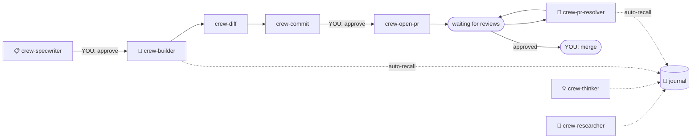

# 🏴‍☠️ El Capitan

Your engineering crew, orchestrated. Spec it, build it, ship it — you just approve.

el-capitan is a portable system of AI agents and skills for [Cursor](https://cursor.com) and [Claude Code](https://docs.anthropic.com/en/docs/claude-code) that handles speccing, implementing, reviewing, committing, and PR management. You make four decisions: **approve the spec**, **approve the commit**, **approve the PR**, and **merge**.

## Quick start

```bash
git clone git@github.com:crespocarlos/el-capitan.git ~/el-capitan
bash ~/el-capitan/install.sh
```

Then, in any repo:

```
crew spec https://github.com/org/repo/issues/123
```

## Usage

All commands start with `crew`. Explicit routing only — no guessing.

### Pipeline

| Command | What it does |
|---|---|
| `crew spec https://github.com/org/repo/issues/123` | Draft a SPEC.md from an issue |
| `crew implement` | Create worktree + build from SPEC |
| `crew diff` | Review the local diff |
| `crew commit` | Propose a semantic commit message |
| `crew open pr` | Push + open a draft PR |
| `crew address PR #456` | Handle open review comments |

### Standalone

| Command | What it does |
|---|---|
| `crew review PR #456` | Deep-review someone else's PR |
| `crew eval: reviewer says use retry() instead` | Evaluate a single code suggestion |
| `crew learn git worktrees` | Fetch + teach a concept |
| `crew learn https://article.com/post` | Fetch + teach from a URL |
| `crew brainstorm` | Creative session — connect ideas, challenge assumptions |
| `crew brainstorm: what if we cached the API responses?` | Interactive brainstorm on a topic |
| `crew log` | Log the engineering session to the journal |
| `crew recall: how do we handle retries in kibana?` | Search journal by meaning |

## How it works



**Four gates. Everything between runs autonomously.**

## The crew

Six agents, each with skills at their disposal. Agents run as isolated subagents for deep, context-heavy work. Skills run inline for quick, interactive tasks.

### 📋 crew-specwriter

Reads an issue or plain description, explores the codebase for patterns and conventions, and drafts a `SPEC.md` with acceptance criteria tight enough for autonomous implementation.

### 🔨 crew-builder

The implementation engine. Codes in isolation from a SPEC — runs acceptance checks, quality gates, and hands back a report. Launched by `crew implement`, which handles the setup:

- **crew-implement** — selects the spec, creates a worktree, auto-recalls repo patterns, then launches the builder
- **crew-diff** — reviews the local diff for type safety, missing tests, and pattern violations
- **crew-commit** — proposes a [conventional commit](https://www.conventionalcommits.org/) message, waits for approval
- **crew-open-pr** — pushes the branch, generates a PR description, opens a draft PR (fork-aware)

### 🔍 crew-pr-reviewer

Deep-reviews someone else's PR. Reads full files (not just the diff), traces impact across the codebase, verifies test coverage, and produces a structured review grouped by severity.

### 🧩 crew-pr-resolver

When someone reviews *your* PR — fetches all unresolved threads and processes them in batch: applying, adapting, rejecting, or deferring each one.

- **crew-eval-pr-comments** — evaluates a single suggestion from any source (reviewer, Copilot, colleague). Presents its verdict for your approval before acting.

### 🔬 crew-researcher

Give it a URL, a PR, a repo, or just a concept name — it fetches the content, distills what matters, and teaches you. Writes a rich learning entry to the journal so the knowledge persists.

### 💡 crew-thinker

The brainstorm partner. Two modes: *pipeline* (connects new learnings with past sessions and generates experiments) or *brainstorm* (interactive back-and-forth to flesh out ideas, challenge assumptions, and explore what-if scenarios). Can offer to draft a SPEC when an idea solidifies.

- **crew-log** — records an engineering session, auto-gathers context, writes to the monthly journal
- **crew-recall** — searches the journal by meaning (semantic search), metadata (grep), or overview (summary)

## Key features

### Worktree-first

`crew implement` creates a git worktree with a conventional branch (`feature/`, `bugfix/`, etc.) so implementation happens in an isolated directory. `crew-pr-resolver` resolves to the correct worktree before applying changes. Main stays clean.

### Journal-based memory

Patterns, conventions, and learnings live in `~/.agent/journal/` as monthly markdown files with local embeddings. Key crew members auto-recall repo-specific patterns at session start — no manual config needed.

### Local semantic search

Optional but powerful. Uses [Ollama](https://ollama.ai) + ChromaDB — everything stays on your machine.

```bash
ollama pull nomic-embed-text
pip install chromadb ollama
journal-search index
```

Without these, everything works — `crew-recall` falls back to ripgrep.

### Add-ons

Drop custom agents or skills into `~/.cursor/agents/` or `~/.cursor/skills/` as regular files. The orchestrator discovers them at runtime.

```bash
# Symlinks = core (el-capitan), regular files = your add-ons
find ~/.cursor/agents ~/.cursor/skills -maxdepth 2 -type f -name '*.md' ! -type l
```

## Task state

All task data lives outside any repo at `~/.agent/`:

```
~/.agent/
├── PROFILE.md              ← your context (optional, gitignored)
├── journal/                ← monthly entries with embeddings
├── vectorstore/            ← ChromaDB data (auto-created)
├── tools/journal-search    ← semantic search CLI
└── tasks/<repo>/<branch>/  ← SPEC.md, PROGRESS.md, SESSION.md
```

Path resolved automatically from git state. Journal and profile are private — never tracked by git.

## Prerequisites

| Requirement | Required? |
|---|---|
| [Cursor](https://cursor.com) or [Claude Code](https://docs.anthropic.com/en/docs/claude-code) | Yes |
| Git + [GitHub CLI (`gh`)](https://cli.github.com) | Yes |
| Python 3.9+ | For semantic search |
| [Ollama](https://ollama.ai) + `nomic-embed-text` | Optional |
| `pip install chromadb ollama` | Optional |

## Install

```bash
git clone git@github.com:crespocarlos/el-capitan.git ~/el-capitan
bash ~/el-capitan/install.sh
```

New machine = clone + install. Everything restored via symlinks. Task state starts empty. Journal and profile persist locally.

## License

[MIT](LICENSE)
