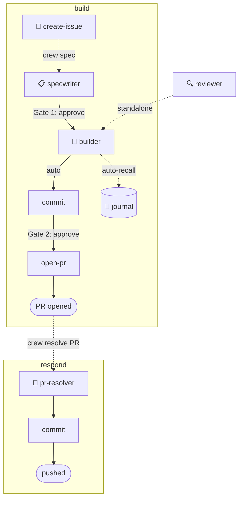

# 🏴‍☠️ El Capitan

**A spec-driven AI engineering crew for Cursor and Claude Code.**

El Capitan gives you a team of coordinated AI agents that follow a structured pipeline — from drafting a spec to opening a pull request. You stay in control at two gates: you approve the spec before any code is written, and you approve the commit message before anything is pushed. Everything in between is automated.

Works in any git repository. All state lives outside your repos. No cloud sync, no vendor lock-in.

---

## Contents

- [How it works](#how-it-works)
- [Workflows](#workflows)
- [Quick start](#quick-start)
- [Prerequisites](#prerequisites)
- [Installation](#installation)
- [Command reference](#command-reference)
- [The crew](#the-crew)
- [Architecture](#architecture)
- [Configuration](#configuration)
- [Extending el-capitan](#extending-el-capitan)
- [License](#license)

---

## How it works



**Two workflows. Two explicit gates in `build`.** Drive each step manually — `crew implement` → `crew review` → `crew commit` → `crew open pr` — or let the pipeline guide you.

El Capitan has three layers:

| Layer | File | Job |
|---|---|---|
| **Router** | `.cursor/rules/crew-router.mdc` | Maps `crew <command>` to the right handler |
| **Orchestrator** | `.cursor/rules/crew-orchestrator.mdc` | Pipeline state machine, session awareness |
| **Crew agents** | `~/.claude/agents/crew-*.md` | Orchestrate multi-persona workflows (spec, review, build, etc.) |
| **Runtime** | ralph, hooks, journal tools | Execution engines |

---

## Workflows

### `build` — build anything

Feature, bug fix, refactor, chore — the pipeline is the same. Crew-specwriter infers whether to use the standard or bug template from the content of your request.

```
crew spec https://github.com/org/repo/issues/123  # spec from an issue
crew spec <plain description>                      # or from a description
```

Stages: **spec → implement → review → commit → open-pr**  
Terminal: PR opened as draft

### `respond` — respond to review comments

Fetches all unresolved review threads on an open PR, evaluates each one, proposes edits and replies, and resolves threads after your approval — in a single batch.

```
crew resolve PR #456
```

Stages: **address-pr → commit → push**  
Terminal: all threads resolved and pushed

---

## Quick start

```bash
git clone git@github.com:crespocarlos/el-capitan.git ~/el-capitan
bash ~/el-capitan/install.sh
```

Then open any repository in Cursor or Claude Code and type:

```
crew spec <issue URL or description>
```

> All `crew` commands are typed into the AI chat, not the terminal.

---

## Prerequisites

### Required

| Dependency | Purpose | Install |
|---|---|---|
| [Cursor](https://cursor.com) or [Claude Code](https://docs.anthropic.com/en/docs/claude-code) | The AI runtime | — |
| Git | Version control | `brew install git` |
| [GitHub CLI (`gh`)](https://cli.github.com) | Issues, PRs, GraphQL queries | `brew install gh && gh auth login` |
| `jq` | JSON processing in shell scripts | `brew install jq` |

### Optional — recommended

| Dependency | Purpose | Install |
|---|---|---|
| [ralph](https://github.com/simianhacker/ralph-loop) | Autonomous implementation loop — runs `crew implement` without holding a conversation open | See repo |
| [Ollama](https://ollama.ai) + `nomic-embed-text` | Local semantic search over your journal | `brew install ollama && ollama pull nomic-embed-text` |
| ChromaDB | Vector store for journal embeddings | `pip install chromadb ollama` |
| SemanticCodeSearch MCP | Semantic code search across the codebase inside Claude Code | `claude mcp add --scope user SemanticCodeSearch -- npx @elastic/semantic-code-search-mcp-server` |

> **Without ralph:** `crew implement` falls back to inline implementation — same tasks and checks, conversational rather than autonomous.  
> **Without Ollama + ChromaDB:** `crew recall` falls back to ripgrep full-text search.  
> **Without SemanticCodeSearch:** crew-specwriter uses file reads and grep for codebase exploration.

### macOS note

The notification hook (`osascript`, iTerm2 focus) is macOS-only. On other systems it exits silently — no configuration needed.

---

## Installation

```bash
bash -c "$(curl -fsSL https://raw.githubusercontent.com/crespocarlos/el-capitan/main/install.sh)"
```

Or clone first if you prefer to review before running:

```bash
git clone git@github.com:crespocarlos/el-capitan.git ~/el-capitan
bash ~/el-capitan/install.sh
```

`install.sh` creates symlinks from `~/.cursor/`, `~/.claude/`, and `~/.agent/bin/` back to `~/el-capitan`. No files are copied — updates to the repo are reflected immediately.

**To update:**

```bash
cd ~/el-capitan && git pull
bash install.sh
```

**To reinstall on a new machine:**

```bash
git clone git@github.com:crespocarlos/el-capitan.git ~/el-capitan
bash ~/el-capitan/install.sh
```

Task state and journal are not tracked by git — they live in `~/.agent/tasks/` and `~/.agent/journal/` and persist locally.

---

## Command reference

All commands start with `crew`. Type them in the AI chat — not your terminal.

### Build workflow

| Command | What it does |
|---|---|
| `crew spec <issue URL or #N>` | Draft a SPEC.md from a GitHub issue |
| `crew spec <plain description>` | Draft a SPEC.md from a description |
| `crew implement` | Select spec, create worktree, build |
| `crew review` | Multi-lens review of your changes |
| `crew review address` | Work through last review findings inline |
| `crew commit` | Propose and apply a semantic commit message |
| `crew open pr` | Push the branch and open a draft PR |

### Respond workflow

| Command | What it does |
|---|---|
| `crew resolve PR #456` | Fetch and action all unresolved review threads |

### Review & quality

| Command | What it does |
|---|---|
| `crew review` | Multi-lens self-review of your branch diff vs main |
| `crew review changes` | Multi-lens review of staged changes (pre-commit) |
| `crew review PR #456` | Multi-lens review of someone else's PR |
| `crew review spec` | Multi-lens review of the active SPEC.md |
| `crew review idea` | Multi-lens review of the current session discussion |
| `crew review idea: <text>` | Multi-lens review of a pasted idea or proposal |
| `crew review address` | Work through last review findings inline |

### Memory & journal

| Command | What it does |
|---|---|
| `crew log` | Record the session to the engineering journal |
| `crew recall: <question>` | Search the journal by meaning or keyword |

### Utilities

| Command | What it does |
|---|---|
| `crew create issue: <description>` | Structure a rough idea into a GitHub issue and file it |
| `crew cleanup` | Remove stale worktrees, branches, and task directories |
| `crew test` | Discover and run tests scoped to the current diff |

---

## The crew

4 orchestrator agents, 10 persona subagents, 9 skills.

**Orchestrators** dispatch persona subagents in parallel for multi-lens analysis. **Skills** run inline for interactive pipeline steps. All agents are markdown files — readable, editable, version-controlled.

### 📋 crew-specwriter

Drafts a `SPEC.md` from a GitHub issue or plain description. Explores the codebase for existing patterns, drafts acceptance criteria tight enough for autonomous implementation, then runs a silent three-way critique (scope, adversarial, implementer personas) before presenting the result.

- Automatically selects the standard or bug spec template based on the content of your request — no flag needed
- Critiques cover: scope creep, missing edge cases in AC, implementation ambiguity
- Stops at Gate 1 — waits for your approval before any code is written

**Persona subagents:** `specwriter-scope`, `specwriter-adversarial`, `specwriter-explorer`

**Skills:** `crew-implement`, `crew-commit`, `crew-open-pr`, `crew-create-issue`, `crew-cleanup`, `crew-address-review`

### 🔨 crew-builder

The implementation engine. Reads a SPEC.md, works through each task in order, runs per-task acceptance checks, and writes a REPORT.md. Launched by `crew implement`, which handles worktree setup, spec selection, and pattern auto-recall.

- Supports two modes: **ralph** (autonomous loop) or **inline** (conversational, same protocol)
- Per-task acceptance checks run before marking each task done
- Hands back a REPORT.md — all pass/fail results, changed files

### 🔍 crew-reviewer

Multi-lens review of a branch diff, a PR, a SPEC.md, staged changes, or an idea/proposal. Dispatches reviewer personas in parallel and consolidates findings into a single flat numbered list — each finding labeled inline with `[blocking]`, `[suggestion]`, `[question]`, or `[nit]`.

For idea and spec reviews, the output is evaluative: a verdict (`proceed / revisit / blocked`) followed by findings using `[blocking]` and `[concern]` labels, focused on whether the plan holds up.

**Personas:** Code Quality, Adversarial, Fresh Eyes, Architecture, Product Flow  
**Modes:** `crew review` (self), `crew review changes` (staged), `crew review PR #N`, `crew review spec`, `crew review idea`, `crew review address`

### 🧩 crew-pr-resolver

Processes all unresolved review threads on a PR in a single batch: evaluates each thread, proposes edits and reply text, and applies only what you approve. Handles Apply, Adapt, Reject, Defer, and Already Addressed verdicts. Never touches resolved or outdated threads.

---

## Architecture

### File layout

```
el-capitan/
├── AGENTS.md                # Agent guide — bootstrap, conventions, file layout
├── CLAUDE.md                # Claude Code project context for editing el-capitan itself
├── .cursor/
│   ├── rules/               # Always-loaded orchestration rules (.mdc)
│   │   ├── crew-orchestrator.mdc   # Pipeline state machine (always loaded)
│   │   ├── crew-router.mdc         # Routing table (always loaded)
│   │   ├── crew-explorer-conventions.mdc  # Shared tool protocol for explorer subagents
│   │   └── personal.mdc            # Personal engineering preferences (always loaded)
│   ├── agents/              # Agent protocols (.md) — symlink to .claude/agents/
│   │   ├── crew-*.md               # Orchestrator agents
│   │   ├── reviewer-*.md           # Reviewer personas
│   │   ├── specwriter-*.md         # Specwriter personas
│   │   └── tester-*.md             # Tester personas
│   └── skills/              # Inline skill protocols — symlink to .claude/skills/
│       └── crew-<name>/SKILL.md
├── .claude/
│   ├── CLAUDE.md            # Claude Code routing instructions (symlinked to ~/.claude/CLAUDE.md)
│   ├── hooks/               # PostToolUse, Notification, SessionStart hooks
│   └── settings.json        # Hook configuration
├── .agent/
│   ├── tools/               # Shell scripts and Python utilities
│   ├── scripts/             # Fallback dispatch scripts (bash)
│   ├── queries/             # GraphQL query files
│   ├── _SPEC_TEMPLATE.md    # Standard spec template
│   ├── _BUG_SPEC_TEMPLATE.md  # Bug spec template
│   └── _RUNBOOK_TEMPLATE.md   # Validation runbook template
└── install.sh               # Symlink installer
```

### State layout (outside the repo)

```
~/.agent/
├── journal/                 # Monthly engineering journal entries
├── vectorstore/             # ChromaDB embeddings (auto-created)
├── tools/                   # Symlinked from el-capitan
├── scripts/                 # Symlinked from el-capitan
├── queries/                 # Symlinked from el-capitan
└── tasks/<uuid>/            # Per-task state: SPEC.md, PROGRESS.md, SESSION.md, REPORT.md
    └── .task-id             # JSON: uuid, repo_remote_url, branch, slug, created_at
```

Task state is keyed by UUID and resolved via `.task-id` lookup against the current `git remote + branch`. Multiple specs can coexist per branch. Completed tasks are never deleted automatically.

### Context budget

Always-loaded context is kept minimal on purpose:

| File | Lines | Loaded |
|---|---|---|
| `crew-orchestrator.mdc` | ~90 | Every session |
| `crew-router.mdc` | ~50 | Every session |
| `personal.mdc` | ~40 | Every session |
| `CLAUDE.md` | ~90 | Every session (Claude Code) |

Orchestrator agents (crew-specwriter, crew-reviewer, etc.) and skill files are loaded per-command, not globally. Fallback dispatch blocks for degraded environments live in `.agent/bin/` — not in agent files.

---

## Configuration

### Personal preferences

`~/.cursor/rules/personal.mdc` (symlinked to `el-capitan/.cursor/rules/personal.mdc`) is your always-loaded personal preferences file. It's read every Cursor and Claude Code session — no crew command needed.

Edit it directly to set engineering philosophy, agent expectations, TypeScript rules, or any context that should always be in scope.

### Claude Code hooks

Project-level hooks in `.claude/settings.json` run automatically:

| Hook | Trigger | What it does |
|---|---|---|
| `PostToolUse` | Every Bash/Write/Edit call | Logs to `~/.agent/telemetry/` as JSONL |
| `Notification` | Claude needs input | macOS notification + iTerm2 focus |
| `SessionStart` | Session begins | Logs session start time |

Hooks exit 0 on error — they never block the agent. Telemetry is local-only.


### Semantic journal search

After indexing, `crew recall` supports natural-language queries:

```bash
# Index your journal
journal-search.py index

# Then in chat:
crew recall: how did we handle the retry logic in kibana?
```

Without Ollama + ChromaDB, `crew recall` falls back to ripgrep full-text search — still useful, just not semantic.

---

## Extending el-capitan

### Add a custom skill

1. Create `~/.cursor/skills/<name>/SKILL.md` with a `## Protocol` section
2. Add a routing entry to `~/.cursor/rules/crew-router.mdc`
3. Regular files (not symlinks) are treated as add-ons and never overwritten by `install.sh`

### Add a custom agent

1. Create `~/.cursor/agents/<name>.md` with YAML frontmatter:
   ```yaml
   ---
   name: my-agent
   description: "What it does and when to trigger it."
   ---
   ```
2. Add a routing entry to `~/.cursor/rules/crew-router.mdc`

### Identify add-ons vs core

```bash
# Symlinks = core (managed by el-capitan), regular files = your add-ons
find ~/.cursor/agents ~/.cursor/skills -maxdepth 2 -name '*.md' ! -type l
```

### Update routing

`crew-router.mdc` is the single source of truth for the routing table. `.claude/CLAUDE.md` delegates to it — do not duplicate routing entries there.

---

## License

[MIT](LICENSE)
